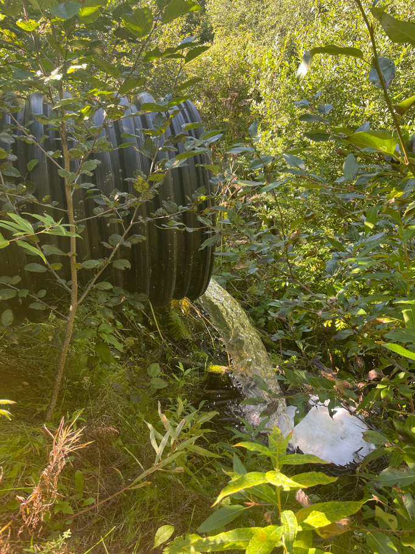

--- 
title: "Expanding and Corroborating the Known Extent of Anadromous Waters in the Kenai Peninsula Throughout the Kenai Peninsula"
author: "Benjamin Meyer, Kenai Watershed Forum"
date: "`r Sys.Date()`"
site: bookdown::bookdown_site
output: bookdown::gitbook
documentclass: book
bibliography: [book.bib, packages.bib]
biblio-style: apalike
link-citations: yes
github-repo: 'https\://bookdown.org/kwfwqx/awc_expansion/'
description: "This is a minimal example of using the bookdown package to write a book. The output format for this example is bookdown::gitbook."
always_allow_html: yes
---


# Introduction

```{r juv-salmon1, echo = F, fig.cap = "Juvenile Coho Salmon"}

knitr::include_graphics('images/juv_coho1.jpeg')

```

```{r , include=FALSE}
knitr::opts_chunk$set(echo = TRUE, warning = F, message = F)

# clear environment
rm(list=ls())

# load packages
library(bookdown)
library(tinytex)
library(tidyverse)
library(googlesheets4)
library(lubridate)
library(readr)
library(readxl)
library(writexl)
library(hms)
library(plotly)
library(DT)
library(xlsx)
library(leaflet)
library(DT)
library(ggpubr)
library(plotrix)
library(packrat)
library(foreign)
library(webshot)
webshot::install_phantomjs()

# set plotting themes

## geom_col plots theme
col_theme <- theme(axis.title = element_text(size = 14, face = "bold"),
                   strip.text = element_text(size = 14, face = "bold"),
                   legend.title = element_text(size = 14, face = "bold"),
                   legend.text = element_text(size = 14),
                   axis.text = element_text(size = 14))

## geom_points plots theme
points_theme <- theme(axis.title = element_text(size = 14, face = "bold"),
                   strip.text = element_text(size = 14, face = "bold"),
                   legend.title = element_text(size = 14, face = "bold"),
                   legend.text = element_text(size = 14),
                   axis.text = element_text(size = 11, face = "bold"),
                   title = element_text(size = 18))

# function to exclude multiple items per column
'%ni%' <- Negate('%in%')

# clarify select function
select <- dplyr::select
```

```{r juv-salmon, echo = F, fig.cap = "Juvenile Coho Salmon", out.height=300, out.height=300}

# put photo of juv salmon here, pics on icloud from 8/31/2021

# knitr::include_graphics('images/example_TIR_img.jpg')

```

This document contains preliminary data and analysis related to Alaska Sustainable Salmon Fund project #54014, "Expanding and Corroborating the Known Extent of Anadromous Waters Throughout the Kenai Peninsula."

## Synopsis

The Kenai Peninsula's watersheds are significant producers of Pacific salmon. Critical to Alaska's economic and cultural wellbeing, these salmon support fisheries both inland and throughout Cook Inlet. This project is documenting anadromous spawning, rearing, and migrating salmon in order to increase the anadromous waters recognized in the Alaska Department of Fish and Game's (ADF&G's) Catalog of Waters Important for the Spawning, Rearing or Migration of Anadromous Fishes (AWC). The AWC is Alaska's most powerful tool for regulating, protecting, and conserving anadromous fish habitat.


## Introduction

Salmon are intrinsic to the cultural and economic wellbeing of Alaska, but cannot persist on the landscape without healthy habitat. Through strategic conservation efforts, riparian and instream habitat can continue to maintain salmon populations as well as transport marine-derived nutrients; maintain hydrology; provide contiguous green space for recreation and access, cultural resource protection, plant dispersal, and wildlife movement; connect existing protected areas; and provide refuge during a rapidly changing climate. In recognition of the importance of protecting anadromous fish habitat, the State of Alaska enacted Alaska Statute 16.05.871, Protection of Fish and Game, which requires the state to list rivers, lakes, and streams important for the spawning, rearing, or migration of anadromous fish, while also requiring the prior approval of construction or use of said waterbody that may result in adverse effects on salmon populations. In response, ADF&G began overseeing the AWC whose data is now publicly hosted online for resource managers and interested members of the public to utilize.

Each year, ADF&G solicits anadromous stream nominations from statewide efforts from the previous year. Once accepted, these nominations are incorporated into the AWC and its associated atlas. To date, the AWC includes nearly 20,000 anadromous streams, rivers, and lakes, though it is widely understood that this number represents a fraction of anadromous waterbodies throughout the state. In response, the Kenai Watershed Forum (KWF) has developed an updated internal, regional database based on Geographic Information Systems (GIS) analysis, field visits, and local knowledge to identify stretches of streams, rivers, and lakes that may be critical to spawning, rearing, and migration of anadromous fish but are not listed in the AWC. Throughout this project, KWF will utilize this database to strategically identify fish trapping sites to collect critical fish and habitat data for AWC nomination submissions. Site prioritization will be conducted based on criteria including the increase in protected anadromous fish habitat and alignment of trapping priorities with local agency and partnership goals. These are described in greater detail in the methods section.

KWF has been conducting annual fish trapping events since 2005. A brief update to its database will be conducted prior to project commencement using the newest AWC shapefile from ADF&G so as to avoid trapping in areas that were recently assessed. Mandatory training will also be conducted by the Principal Investigator for all assisting staff and volunteers, including but not limited to identifying ideal anadromous fish habitat; responsible deployment and retrieval of minnow traps; juvenile and adult fish identification; data collection and recording while in the field; and safe travel in bear country. KWF will coordinate with local agency partners to ensure that trapping isn't replicated in the same areas throughout each summer and, as schedules allow, will also partner with local biologists from ADF&G during these trapping efforts.

Since KWF began fish trapping, professional support has been provided by the Kenai Peninsula Borough, the Kenaitze Indian Tribe (KIT), ADF&G, and the United States Fish and Wildlife Service (USFWS), of which KIT, USFWS, and ADF&G have provided financial support for these efforts. ADF&G's most recent contribution was through AKSSF project 44153, Fish Trapping on the Kenai Peninsula. KWF also provides in-kind fish trapping support to local ADF&G biologists each summer on an as-needed basis. This support helps biologists with pre-project habitat assessments as well as with the expansion of the AWC throughout the Kenai Peninsula. Through the use of more elaborate protocol, the expansion of KWF's fish trapping database, and collaboration with local agency representatives, this project will expand upon KWF's previous fish trapping efforts.

KWF will also leverage fish trapping fieldwork to gather additional data for other local anadromous habitat-related efforts, including invasive elodea surveys funded by the Kenai Peninsula Cooperative Weed Management Area (KP-CWMA). Elodea is an aggressively invasive aquatic plant with the potential for substantial negative effects on anadromous habitat.


## Objectives

-   Submit nominations to increase anadromous stream, river, lake, and wetland coverage in the AWC and corresponding atlas

-   Revise or corroborate outdated AWC and atlas data, particularly on Kenai River tributaries experiencing increases in zinc concentrations as well as priority corridors identified by the Kenai Mountains to Sea partnership

```{r include=FALSE}
# automatically create a bib database for R packages
knitr::write_bib(c(
  .packages(), 'bookdown', 'knitr', 'rmarkdown'
), 'packages.bib')
```

<!--chapter:end:index.Rmd-->

# Methods

```{r , include=FALSE}
knitr::opts_chunk$set(echo = TRUE, warning = F, message = F)

# clear environment
rm(list=ls())

# load packages
library(bookdown)
library(tinytex)
library(tidyverse)
library(googlesheets4)
library(lubridate)
library(readr)
library(readxl)
library(writexl)
library(hms)
library(plotly)
library(DT)
library(xlsx)
library(leaflet)
library(DT)
library(ggpubr)
library(plotrix)
library(packrat)
library(foreign)
library(janitor)

# set plotting themes

## geom_col plots theme
col_theme <- theme(axis.title = element_text(size = 14, face = "bold"),
                   strip.text = element_text(size = 14, face = "bold"),
                   legend.title = element_text(size = 14, face = "bold"),
                   legend.text = element_text(size = 14),
                   axis.text = element_text(size = 14))

## geom_points plots theme
points_theme <- theme(axis.title = element_text(size = 14, face = "bold"),
                   strip.text = element_text(size = 14, face = "bold"),
                   legend.title = element_text(size = 14, face = "bold"),
                   legend.text = element_text(size = 14),
                   axis.text = element_text(size = 11, face = "bold"),
                   title = element_text(size = 18))

# function to exclude multiple items per column
'%ni%' <- Negate('%in%')

# clarify select function
select <- dplyr::select
```

## Site selection

Fish trapping sites are identified using KWF's database and further prioritized using the following criteria:

-   Significant increase in protection of anadromous fish habitat through addition of new miles/acreage

-   Ability to provide significant revision and/or data corroboration for outdated catalog data

-   Alignment with trapping priorities of local resource managers as well as partnership efforts including those of Kenai Mountains to Sea (a prioritized corridor list can be found at <https://kenaiwatershed.org/science-inaction/mountains-to-sea/>) and Kenai Peninsula Fish Habitat Partnership (KPFHP)

-   Ease of accessibility via foot travel or all-terrain vehicle (ATV) based on travel time and ability to obtain private property access

-   Proportion of stream or lake adjacent to developed parcels

-   Habitat with medium-high risk assessment rating using the KPFHP's "Freshwater Potential Threats Ranking Table"

-   Tributaries of the Kenai River experiencing recent exceedances for zinc

-   Ability to leverage efforts with local partnership funding provided by groups like the KP-CWMA for invasive elodea surveys by identifying sites that overlap with trapping priorities

-   Unassessed anadromous fish habitat located on tributaries or mainstem waterbodies supporting subsistence fisheries

The project study map may be accessed by following the link at [ArcGIS Online](https://kwf.maps.arcgis.com/apps/webappviewer/index.html?id=ef6e57e2b94c424780b71decf08d50da&extent=-16891358.3246%2C8496162.7219%2C-16658378.2624%2C8619532.0855%2C102100) or in the interactive figure below. Click on the symbol in the upper right hand corner to see the legend. Toggle layers on/off as needed.

<iframe width="800" height="600" frameborder="0" scrolling="no" allowfullscreen src="https://arcg.is/Kji4r">

</iframe>

Prior to minnow trap deployment, we obtained all necessary permits from ADF&G including the Aquatic Resource Permit (ARP). As required by the ARP, the ADF&G local Area Management Biologist was notified of trapping locations and timeframes before going into the field. We also obtained landowner permission for access to sites. Finally, trapping efforts for each day were strategically chosen based on proximity of sites so as to reduce drive and personnel time.

```{r, echo = F}

# generate a list of all un

```

## Fish capture and processing

```{r, minnow-traps, echo = F, fig.cap = "Minnow traps being prepared at by Trout Unlimited volunteers at a training workshop at Soldotna Creek in June 2021"}

knitr::include_graphics('images/Fish_Traps.jpg')

```

### Minnow Trapping

We used Gee minnow traps (Figure \@ref(fig:minnow-traps)) baited with salmon eggs as the primary capture methods for juvenile salmonids. We used commercial salmon eggs as bait and placed them in perforated 2-4 oz containers in order to prevent egg consumption by fish. We labeled traps with KWF contact information using brightly colored flagging tape. At the trapping location, we collected site photos and recorded the following on a datasheet: field technician initials, GPS coordinates of trap deployment site(s), and site drawings with pertinent notes regarding fish habitat. We used a minimum of one baited minnow trap, fully submerged in a discrete location, and properly secured to ensure retrieval. We recorded the date and time of deployment. While not exceeding 24 hours, we allowed traps to soak overnight when feasible. Upon trap retrieval, we recorded the date and time and transferred the trap's contents into a bucket of water.

### Angling

We conducted angling to survey for anadromous fish in habitats such as lakes or large streams and rivers. We employed both traditional spinning rods and fly-fishing techniques. We recorded start and stop time and quantity of anglers.

### Fish processing

We identified each fish to lowest feasible taxa and life stage. We recorded disposition; and in some cases recorded fork length to the nearest millimeter along with photos of identifying features. When completed, we placed fish in a recovery bucket. Once all fish recuperated successfully, we released them near the original capture location. We monitored data throughout the summer for unintended mortalities, and were prepared to cease sampling and contact the area management biologist should \>10% unintended collection mortality occur. We entered all data into the Aquatic Resource Permit spreadsheet provided by the ADF&G and will submit it with a written report to ADF&G at the conclusion of each permit year.

These data will be utilized to submit nominations for the inclusion of new miles or acres of fish habitat to the AWC as well as revision or corroboration of fish presence.

## Habitat connectivity

In some cases where maps indicated a strong likelihood of anadromous habitat yet we did not capture salmonids, we visited additional sites within the drainage where potential barriers to fish passage may exist such as road crossings or modified lake outlets. We photographed and recorded coordinates at these locations if potential fish barriers were apparent and submitted them to ADF&G for potential inclusion in their [Fish Passage database](https://www.adfg.alaska.gov/index.cfm?adfg=fishpassage.database).

```{r , echo = F, eval = F}

# which are the sites we will visit in 2022?


## read in database
url <- "https://docs.google.com/spreadsheets/d/1S0hwY4EQo9Xtz5d4UnSBCbZoJ0ft_HGQrarfmA5dwNY/edit#gid=0"

## prep data sources

### sample events
sample_events <- read_sheet(url, sheet =  "A_Sample_Event") %>%
  transform(site_arrive_time = as_hms(site_arrive_time),
            site_depart_time = as_hms(site_depart_time)) %>%
  select(-QC1,-QC2,-data_entry,-notes,-crew) %>%
  filter(!is.na(site))


# read in all sample events that occurred in 2021
all_events_2021 <- read_sheet(url, sheet = "A_Sample_Event") %>%
  clean_names() %>%
  select(site,latitude,longitude) %>%
  distinct()

# read in all sites, both new and old
all_sites <- read_sheet(url, sheet = "E_All_Sites") %>%
  clean_names() %>%
  rename(longitude = long,
         latitude = lat)
#%>%
  select(site,latitude,longitude)


```

<!--chapter:end:01-methods.Rmd-->

# Results

```{r , canoe, echo = F, fig.cap = "Kenai Peninsula Trout Unlimited volunteers preparing for fieldwork at Suneva Lake in August 2021."}

knitr::include_graphics('images/kptu_suneva_canoe.jpg')

```

```{r , include=FALSE}
knitr::opts_chunk$set(echo = TRUE, warning = F, message = F)

# clear environment
rm(list=ls())

# load packages
library(bookdown)
library(tinytex)
library(tidyverse)
library(googlesheets4)
library(lubridate)
library(readr)
library(readxl)
library(writexl)
library(hms)
library(plotly)
library(DT)
library(xlsx)
library(leaflet)
library(DT)
library(ggpubr)
library(plotrix)
library(packrat)
library(foreign)
library(kableExtra)

# set plotting themes

## geom_col plots theme
col_theme <- theme(axis.title = element_text(size = 14, face = "bold"),
                   strip.text = element_text(size = 14, face = "bold"),
                   legend.title = element_text(size = 14, face = "bold"),
                   legend.text = element_text(size = 14),
                   axis.text = element_text(size = 14))

## geom_points plots theme
points_theme <- theme(axis.title = element_text(size = 14, face = "bold"),
                   strip.text = element_text(size = 14, face = "bold"),
                   legend.title = element_text(size = 14, face = "bold"),
                   legend.text = element_text(size = 14),
                   axis.text = element_text(size = 11, face = "bold"),
                   title = element_text(size = 18))

# function to exclude multiple items per column
'%ni%' <- Negate('%in%')

# clarify select function
select <- dplyr::select
```

```{r, echo = F}


# notes 

## total number of sites with anad species ("n of x sites had newly id'd spp")

## 

```

```{r, echo = F}
# summarise total capture effort

## read in 
url <- "https://docs.google.com/spreadsheets/d/1S0hwY4EQo9Xtz5d4UnSBCbZoJ0ft_HGQrarfmA5dwNY/edit#gid=0"

## prep data sources

### sample events
sample_events <- read_sheet(url, sheet =  "A_Sample_Event") %>%
  transform(site_arrive_time = as_hms(site_arrive_time),
            site_depart_time = as_hms(site_depart_time)) %>%
  select(-QC1,-QC2,-data_entry,-notes,-crew) %>%
  filter(!is.na(site))

### fish count
fish_dat <- read_sheet(url, sheet = "F_Fish_ID") %>%
  filter(!is.na(site))


### how many unique sampling events (unique date/site) did we have in 2021?
n_events <- sample_events %>%
  group_by(site,site_arrive_time) %>%
  tally() %>%
  nrow() %>%
  as.character()


### number of sites

#### total value only
n_sites_total <- sample_events %>%
  group_by(site) %>%
  tally() %>%
  nrow() %>%
  as.character()

#### table of values by site
n_sites <- sample_events %>%
  group_by(site) %>%
  tally() 

### total fish
fish_ct <- fish_dat %>%
  summarise(n = sum(count)) %>%
  as.character()

### total unique species
spp_ct <- fish_dat %>%
  group_by(species) %>%
  summarise(n = sum(count)) %>%
  nrow() %>%
  as.character()

### count by species
spp_ct_n <- fish_dat %>%
  group_by(species) %>%
  summarise(n = sum(count))

### count by species at each site
site_spp_ct <- fish_dat %>%
  group_by(species,site) %>%
  summarise(n = sum(count)) %>%
  pivot_wider(names_from = "species", values_from = "n") 

### total fish at each site
total_by_site <- fish_dat %>%
  group_by(site) %>%
  summarise(total_fish = sum(count))

#### join site totals to species totals by site
z <- left_join(site_spp_ct,total_by_site)

#### remove NAs
site_spp_ct[is.na(site_spp_ct)] <- 0

```

Note: all fishing effort and capture results are current as of `r Sys.Date()`.

## Fish capture

Since initiation of fieldwork in summer 2021:

-   We have conducted a total of `r n_events` sampling events at `r n_sites_total` unique sites. See the project map in the Methods section ("[Site selection](##%20Site%20selection)") for a current summary of where and when sampling events have occurred.

    -   Table \@ref(tab:site-visits) summarises total samping events by individual site. We typically sampled a site only one time each in summer 2021, with the exception of two sites: "Lower Soldotna Creek", and "Soldotna Creek Parcel." Both of these sites are highlighted in further detail in the "Discussion" section.

-   We have captured `r fish_ct` fish comprised of `r spp_ct` unique species. Table \@ref(tab:ct) summarizes current fish capture count by species.

-   Table \@ref(tab:site-spp-ct) summarizes total fish capture for each species by site.

```{r, site-visits, echo = F, fig.cap = "cap"}
n_sites %>%
  kable(caption = "Total site visits")

```

<br>

```{r ct, echo = F, fig.cap = "Total fish capture count by species"}

spp_ct_n %>%
  kable(caption = "Total fish capture count by species") 

#%>%
 # kable_paper(full_width = F, html_font = "Cambria", 
  #            bootstrap_options = c("striped", "hover", "condensed", "responsive"))

```

<br>

```{r site-spp-ct, echo = F, fig.cap = "cap"}
library(kableExtra)

site_spp_ct %>%
  kable(caption = "Total fish capture count by species at each site. In the Online document, use scroll bars to see the full table.") %>%
 # kable_paper(full_width = F, html_font = "Cambria", 
            #  bootstrap_options = c("striped", "hover", "condensed", "responsive")) %>%
  kable_styling(latex_options = c("striped")) %>%
  landscape()
 # scroll_box(width = "100%", height = "500px")


```

<br>

## Anadromous habitat

```{r, echo = F}

# total new stream kilometers
new_stream_km <- 0.46

# total new lake hectares

```

Fish capture data and supporting documentation was submitted to the Alaska Department of Fish and Game in Winter 2022. Sites where anadromous fish have not previously been documented may be considered for addition to the Anadromous Waters Catalog. Pending acceptance of these data, the current estimate for total new stream kilometers that will be added to the AWC in 2021 is `r new_stream_km` km. See the [Discussion](#Discussion) section for further details on factors influencing yearly totals.

```{r, echo = F}

# prep data format for ARP report: https://www.adfg.alaska.gov/sf/SARR/AWC/index.cfm?ADFG=nomSubmit.about

# determination 12/16/21: the data is formatted in such a way that it will be required to manually enter it into the ARP. Reformat field forms and database for 2022 to better match ARP format!

# prep fish capture data ("fish_dat") in R, add location data manually in ARP formatted sheet
arp <- fish_dat %>%
  
  # rectify ARP column named "additional count"; leave blank if count = 1, make n-1 if count > 1
  # presumed that count = 1 if additional count = 0
  mutate(`Additional count (1)` = ifelse(fish_dat$count <= 1, "0",fish_dat$count - 1)) %>%
  
  # rename columns
  rename(`Location ID (optional)` = site,
         Date = site_depart_date,
         Species = species,
         `Life stage` = lifestage,
         `Length (mm) (NO estimates or ranges)` = fl_mm,
         `Length method` = length_method,
         `Weight (g)` = wt_g,
         `Disposition (1)` = disposition,
         Comments = notes) %>%
  
  # create new columns
  mutate(`Latitude (decimal degrees)` = "",
         `Longitude (decimal degrees)` = "",
         Datum = "",
         `Coordinate determination method` = "",
         `Name of water body` = "",
         `Observer name (the first and last name of the person handling fish)` = "",
         `Fish collection method` = "",
         Sex = "",
         Age = "",
         `Age method (sample type)` = "",
         `ADF&G GCL` = "",
         `Additional count (2)` = "",
         `Disposition (2)` = "",
         `Anesthesia/ Sedative Used (Leave blank if none used)` = "",
  
  
         
         ) %>%
  
  # remove extraneous columns
  select(-count,-camera_id,-photo_id) %>%
    
  # order columns to match ARP
  select(
  `Location ID (optional)`,
  `Latitude (decimal degrees)`,
  `Longitude (decimal degrees)`,
  Datum,
  `Coordinate determination method`,
  `Name of water body`,
  Date,
  `Observer name (the first and last name of the person handling fish)`,
  `Fish collection method`,
  `Species`,
  `Life stage`,
  `Length (mm) (NO estimates or ranges)`,
  `Length method`,
  `Weight (g)`,
  Sex,
  Age,
  `Age method (sample type)`,
  `ADF&G GCL`,
  `Additional count (1)`,
  `Disposition (1)`,
  `Additional count (2)`,
  `Disposition (2)`,
  `Anesthesia/ Sedative Used (Leave blank if none used)`,
  Comments						
  )
  
# export this doc and manually prep in excel for submission to ARP
# next year : make sure data format does not require manual preparation in excel!

write.csv(arp,"output/arp_2021.csv", row.names = F)


```


<!--chapter:end:02-results.Rmd-->

# Discussion

## 2021 Fieldwork Summary

### Anadromous habitat surveys

In summer 2021 we surveyed sites primarily in the region North of Kenai/Soldotna within an hour's walking distance of the road system. In some cases where employees of Kenai Watershed Forum were visiting remote fly-in locations for fieldwork on separate projects, they also surveyed for presence of anadromous fish, thus leveraging resources among projects.

Survey site selections were made primarily by visually assessing the overlaid map layers of the Anadromous Waters Catalog with the [USGS National Hydrography Database](https://www.usgs.gov/core-science-systems/ngp/national-hydrography)^[https://www.usgs.gov/core-science-systems/ngp/national-hydrography] (NHD). In areas where previously documented anadromous stream or lake extents ended yet connected waterbodies continued upstream, we targeted sites suitable for minnow trapping and/or hook and line survey.

In one case, KWF was notified of a potentially important sampling location by colleagues with state and federal agencies. At this site, a stream segment that had not yet been documented as anadromous had been excavated by a landowner several weeks prior. KWF was able to document the resultant disturbed stream channel as anadromous. These efforts are further detailed below in the section [Highlights: Soldotna Creek Tributary](###%20Highlight:%20Soldotna%20Creek%20Tributary).

At most sites surveyed in the North Kenai/Nikiski areas, we captured primarily non-anadromous species such as stickleback and sculpin. We also captured some resident salmonid species such as Dolly Varden and Rainbow Trout.

These results support several conclusions that will direct future fieldwork efforts into summer 2022:

-   A need exists to refine methods for survey site selection. Relying on visual assessment of overlay between documented AWC habitat and the NHD map may be insufficient as a prospecting guide for yet-unidentified anadromous waters. Early discussions in Fall 2021 with personnel at ADF&G's Habitat Division in Anchorage have yielded valuable insight and potential for collaboration. KWF will work with ADF&G in winter 2021/2022 to further refine fieldwork site selection.

-   Some drainages in the North Kenai/Nikiski area that may have been historically anadromous have man-made barriers to fish passage that we identified in Summer 2021. Two such examples are discussed further in the section below, [Highlight: Habitat Connectivity](####%20Highlight:%20Habitat%20Connectivity). Identifying fish passage barrier sites is an important first step in determining if restoration feasible.

-   The task of documenting yet-unidentified anadromous habitat is particularly urgent in watersheds encompassing urban and suburban areas.

#### Highlight: Soldotna Creek Tributary

KWF was notified of a previously undocumented tributary segment in the Soldotna Creek drainage in July 2021. The tributary was documented as anadromous up to a road crossing approximately 100 m upstream from the Soldotna Creek mainstem, but the stream channel continued beyond. The stream segment upstream of the road crossing had been recently excavated as part of a new development project, but it was suspected that the modified channel still supported fish populations. KWF staff placed minnow traps at the most upstream locations where the traps could still be submerged. Over the course of several site visits we captured a total of 65 Coho Salmon and five Dolly Varden.

KWF submitted these data in ADFG's September 2021 call for data, and documented the approximate paths of existing stream channels, supported by several dozen ground-truthing photos. These data are displayed in the map figure below, and are also accessible at [ArcGIS Online](https://arcg.is/1XO9n5)^[https://arcg.is/1XO9n5]).


<iframe width="500" height="400" frameborder="0" scrolling="no" allowfullscreen src="https://arcg.is/0qrH45"></iframe>


The post-hoc documentation of this previously unidentified salmon stream after it has been altered emphasizes the need for continued thorough efforts to document anadromous habitat, particularly in watersheds experiencing growth and development. Communication with property owners remains critical to the task of identifying previously undocumented anadromous habitat.

<br>

#### Highlight: Habitat Connectivity

In two cases where map interpretation suggested presence of salmonids but we captured none, we visited other locations in the watershed where fish barriers may be present. We found evidence of man-made fish barriers at two locations:

1.  [Suneva Lake]{.ul} - Suneva Lake lies to the North of Daniels Lake in the Nikiski area. The lake's surface area is appx 1.0 sq km, and flows directly in to Cook Inlet 0.61 km downstream from the lake outlet. Aerial imagery indicates that littoral is \~95% undeveloped. Littoral parcels are primarily privately owned.

    We conducted sampling events on two separate days at Suneva lake, using minnow traps as well as angling. We captured stickleback and sculpin on both occasions, but no salmonids despite extensive effort.

    We visited the outlet at Suneva lake and discovered two perched culverts installed where the outlet stream crosses Sockeye Avenue (see figure \@ref(fig:suneva-outlet). The culvert is likely impeding fish passage, as there is a drop of several feet between the stream channel and the culvert outlet.

    A site visit to the mouth of the creek flowing from Suneva Lake at its outlet at Cook Inlet will help determine if the waterway has potential to host anadromous species and may be part of future fieldwork.

```{r suneva-outlet, echo = F, fig.cap = "Perched culvert near outlet of Suneva Lake, intersection with Sockeye Avenue",  out.height=400, out.extra= "angle = 90"}



# note: photo is rotated 90 degrees in the code chunk options due to odd behavior; photo was showing up sideways upon document knit
```

2.  [Salamatof Creek]{.ul} - Salatamtof Creek lies North of Kenai and South of Nikiski, crossing the Kenai Spur highway. A stream connection of 1.56 km flows from Lower Salamatof Lake to Cook Inlet, and a stream segment of 2.84 km connects the lower lake to Salamatof Lake. We sampled at a site in the stream segment connecting the two lakes on one occasion in Summer 2021 and captured a several hundred sticklebacks, but no salmonids.

We visited the location where maps indicated that Salamatof Creek crosses the Kenai Spur Highway in August 2021 (figure \@ref(fig:salamatof-creek)).

At the road crossing we observed a culvert passage for Salamatof Creek below the highway, but no flowing water. The visible nearby body of water at this location appeared to be lotic in nature, and no outflow was readily evident.

```{r salamatof-creek, echo = F, fig.cap = "Salamatof Creek drainange, North of Kenai, Alaska. Red X indicates location of fish passage barrier."}

knitr::include_graphics('images/Inkedsalamatof_map.jpg')

```

Based on observations at the road crossing, it is possible that historical construction activities altered the flow path of Salamatof Creek such that it no longer connects to Cook Inlet except at very high flow volumes. A review traditional knowledge in this area could help reveal if this watershed may have previously been an anadromous waterbody. Additionally, a review of historical aerial imagery could reveal how channel path or lake acreage extent may have changed in recent decades.

#### Highlight: Collaborations

We found opportunities to collaborate with multiple partner organizations and researchers as part of our field efforts. Highlights include:

-   Kenai Peninsula Chapter of Trout Unlimited (KPTU)- In May 2021 we entered in to an agreement with KPTU to collaborate on a project funded by their Embrace-a-Stream program. The project also aims to expand and corroborate the Anadromous Waters Catalog, using citizen scientists trained by local biologists. In Summer 2021 Kenai Watershed Forum held a half-day training session on field methodology with fifteen participants, and held three sampling events. The collaboration will continue into Summer 2022.
-   Salamatof Native Association - We worked with staff from Salamatof Native Association who volunteered with our crew on four fieldwork days
-   Kenai Watershed Forum Elodea Surveys - Crews with Kenai Watershed Forum performing surveys for the invasive aquatic plant Elodea were trained in minnow trapping techniques. On several trips to remote fly in lakes, they were able to survey for presence of juvenile salmonids as part of the same trip.


### Outreach and other activities

In addition to fieldwork efforts aimed at prospecting for unidentified anadromous waters, having personnel mobilized and trained in juvenile fish identification and capture methods allowed for support in two additional efforts:

-   **Education**. In 2021 KWF oversaw 12 fish sampling events aimed exclusively at education and outreach, occurring primarily at Lower Soldotna Creek. These events introduced basic facts about wild salmon life history and habitat to local community members, visitors, journalists, and summer campers. Total participants is estimated in excess of one hundred people.

-   **Culvert replacement**. In summer 2021 KWF oversaw construction activities to replace the culvert carrying the North Fork of the Anchor River underneath Niklovaesk road in the Anchor Point area. As part of these efforts, a small segment of river channel is temporarily de-watered thus fish in this segment must be captured and released downstream prior. KWF personnel was able to capture n = 329 juvenile fish as part of these fish rescue efforts.

### Future work

Fieldwork described in this report will continue in July - September 2022. 

A list of proposed 2022 field survey sites was updated in January 2022 and is maintained in the project online database [Google Sheet](https://bit.ly/eas_data︎)^[https://bit.ly/eas_data] (see the tab titled “E_All_Sites”). These sites are visible in the project map as open red circles (see section 2.1 Site selection).

<!--chapter:end:03-discussion.Rmd-->

